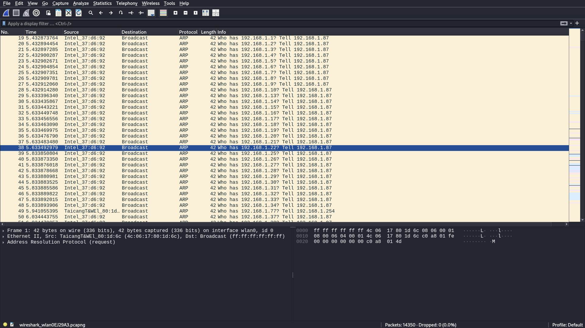
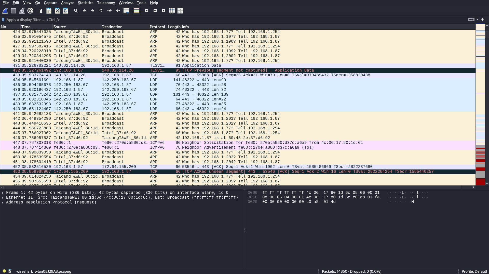

# 🔐 Task 1 – Internal Network Port Scanning using Nmap (Cybersecurity Internship)

This repository documents the completion of Task 1 from my cybersecurity internship at **Elevate Labs** (August 2025). The goal was to perform a local network reconnaissance scan using **Nmap**, interpret the results, and understand the importance of internal threat visibility.

> ✅ Task completed on **Kali Linux** using CLI tools  
> ✅ No paid tools used — strictly ethical, open-source, and educational  
> ✅ GitHub used to document & showcase professional learning progress  

---

## 🎯 Objective

To simulate real-world internal reconnaissance by scanning the local network (`192.168.1.0/24`) for:
- Live hosts (active systems)
- Open TCP ports
- Running services and versions
- OS fingerprinting and traceroute paths

---

## 🛠️ Tools Used

| Tool        | Purpose                                      |
|-------------|----------------------------------------------|
| `nmap`      | Network scanning, service & OS detection     |
| `wireshark` | Packet analysis and traffic capture (optional) |
| `Linux CLI` | Command-line driven scanning and documentation |

---

## ⚙️ Nmap Command Used

```bash
sudo nmap -sS -sV -O -A 192.168.1.0/24 -oN task1.txt
```

### Explanation of Flags:
- `-sS` → Stealth TCP SYN scan (quick + stealthy)
- `-sV` → Service version detection
- `-O` → OS fingerprinting
- `-A` → Aggressive scan: OS, traceroute, script scanning
- `-oN` → Output in normal format to file (`task1.txt`)

---

## 🌐 Scanning Environment

- **IP Range Scanned**: `192.168.1.0/24`
- **Platform**: Kali Linux
- **Scan Duration**: ~3.5 minutes
- **Live Hosts Detected**: 6

---

## 📋 Key Findings Summary

| IP Address      | Details                                                       |
|------------------|---------------------------------------------------------------|
| `192.168.1.254`  | Router: SSH (Dropbear), HTTP(S), possible Telnet (filtered)   |
| `192.168.1.84`   | Open ports: 49152, 62078 (tcpwrapped — likely protected)       |
| `192.168.1.74`   | Echo port (7) filtered — rarely used today                    |
| `192.168.1.64/77/87` | All ports closed (safe)                                    |

---

## 🧠 Security Observations

- **Open SSH and HTTP ports** on the router can be targeted if not secured.
- Port `23` (Telnet) is **filtered but visible** — legacy and insecure.
- **Tcpwrapped ports** suggest usage of firewall/proxy-level port filtering.
- Most devices have ports closed — a **good security practice**.

---

## 🧪 Screenshots

| Nmap Scan | Wireshark Analysis |
|-----------|--------------------|
|  |  |
|  |  |

> *(More screenshots are available in the `/screenshots/` folder)*

---

## 📝 What I Learned

- How to identify **active hosts** in a subnet using Nmap
- How to use **TCP SYN scans** to map network exposure
- How to analyze results and identify **potential attack surfaces**
- How to document findings **professionally using GitHub**
- How to use **Wireshark filters** for packet visibility (`tcp.flags.syn == 1`)
- How real attackers start with simple recon, and how defenders must be proactive

---

## 🎯 Why This Matters

Port scanning is the **first step in almost every real-world attack** — and learning to perform it ethically helps defenders understand:
- What’s visible from inside the network
- What services should/shouldn’t be exposed
- How to lock down unnecessary services

> As someone committed to cybersecurity, I now better understand how internal scanning forms the basis for both defense and offense in cyber operations.

---

## 💡 Next Steps (What I'm Doing Beyond This Task)

- Learning `nmap` scripting engine (NSE) for vulnerability detection
- Automating scans using Python + Bash
- Practicing Wireshark deeper with real packet data
- Applying this skillset to CTFs and local labs

---

## 🔗 About Me

**Name**: Rachapudi Rohith  
**Role**: B.Tech Student | Cybersecurity Intern | Aspiring Red Teamer  
**Email**: 2400030757@kluniversity.in  
**GitHub**: [Rohith-cyber2617](https://github.com/Rohith-cyber2617)

> 📢 I’m eager to apply my skills in a full-time role where I can grow as a cybersecurity professional, contribute to real-world projects, and protect digital infrastructure.

---

## 🏁 Final Words

This task isn’t just a checklist item. It’s a **foundation** for the mindset I’m building — to approach cybersecurity as a responsible, skilled, and detail-oriented professional.

I'm grateful to Elevate Labs for this opportunity and I look forward to continuing my growth through this internship — and beyond.
